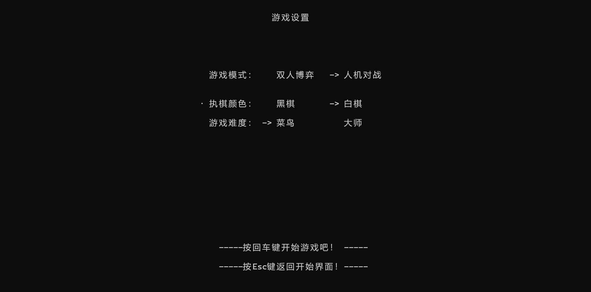
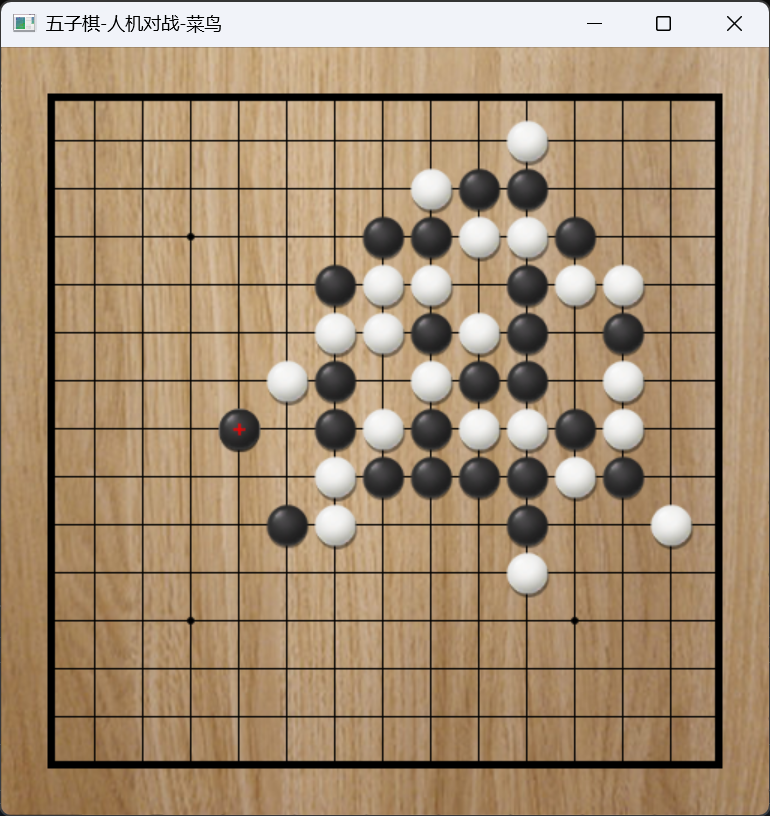

# 简单的五子棋游戏

 

 

这是一个简单的五子棋游戏，使用 `OpenGL, GLUT`绘制游戏游戏的图形界面以及通过键盘和鼠标事件控制游戏流程。游戏启动器使用windows的控制台，涉及到`WinAPI`的使用，因此无法在Linux上运行。

## ✨ 特点

- 包含完整的游戏流程，包括游戏设置，下棋，悔棋，结算等；

- 有人机对弈和双人对弈两种模式供玩家选择；
- 执子颜色，即先后手自由选择；
- 人机对弈模式下有菜鸟和大师两种难度，让玩家体验胜利的快感的同时给玩家提供可选择的挑战；
- 游戏画面材质完善，下棋、结算都有相应的音效。出现非法操作时会及时提醒；
- 游戏进行时控制台有日志输出；
- ~~包含彩蛋。~~

## ⚡️ 开始

1. 解压下载到的安装包；
2. 双击`GoBang.exe`运行游戏；
3. 在启动界面中使用方向键控制选项选择，按回车键确认选择，设置好游戏按回车键即可开始游戏；
4. 游戏界面中左键确认下棋，右键打开菜单，可选择悔棋或认输；
5. 游戏结束后按`r`键重新开始，按`q`键退出到游戏设置页面；
6. 享受您的游戏之旅吧！

## ⌛️ 构建

1. 打开`Visual Studio`，选择`克隆存储库`选项，在`存储库位置`填入`https://github.com/douteaa/GoBang.git`，选择好项目路径后点击`克隆`按钮，完成项目的导入；

2. 项目使用`opencv`库来实现材质的读取，因此您还需在电脑上下载`opencv v4.9.0`,然后在vs项目属性中更改附加包含目录、附加库目录以及附加依赖项；

3. 生成并调试吧！

## 🍭部分游戏画面

   

   
